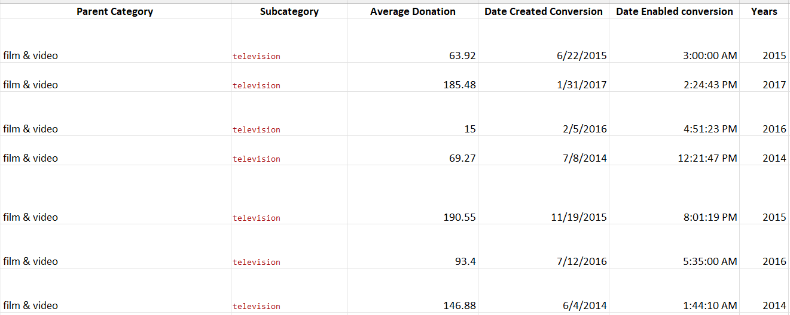

# Kickstarter Analysis 
Performing an analysis on Kickstarter dataset that will show us trends based on specific factors that makes the campaigns successful.
## Overview of the Project
Louise is an upcoming play writer who wants to start a crowdfunding campaign to help fund her play "Fever" for which she is estimating a budget of $10,000. She wants us to help her determine the specific factors that makes her campaigns successful.
## The Purpose of This Analysis
I need to provide a visual representation feedback to Louise with insights to help her gain a better understanding of her campaigns from start to finish. This report will aid her to set her campaign to mirror other campaigns that are successful in the same category.
## Analysis and Challenges
In the Kickstarter raw data I sorted and prepared for the analysis by creating new columns to show parent category, subcategory, Average Donation, convert dates, convert times, and a new column for the year of the Launched date.

- The following chart is based on the Outcomes of the Parent Category. This shows that Theater was the most successful overall. Whene I filtered Theater by United States and Great Britain campaigns. US had a total of 525 successful Theater kickstarters campaign and GB had a total of 258 successful Theater kickstarters campaign.

- The following chart is based on the overall outcomes on Launched Dates. This chart shows that the month that launched the most successful Kickstarter campaigns was May. Also, January, June, July, and October all had the same number of failed campaigns launched.

![](
